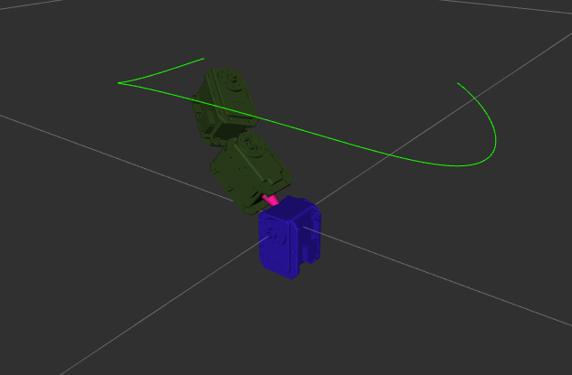

# Snake Robot

a 7-DoF snake robot.

Robotis Dynamixel MX-28AR, Protocol1.0.

Ubuntu 16.04 LTS, ROS kinetic, ROS Control.

## Install Dynamixel

	# install ros kinetic

	# after insert usb2dynamixel
	sudo chmod 777 /dev/ttyUSB0
	
	# install dynamixel lib
	mkdir workspace && cd workspace
	git clone https://github.com/ROBOTIS-GIT/DynamixelSDK.git
	cd DynamixelSDK/build/linux64
	make
	sudo make install
	export LD_LIBRARY_PATH=$LD_LIBRARY_PATH:/usr/local/lib # add dynamixel lib install path
	
	# get code
	cd ~/workspace/src
	git clone https://github.com/guzhaoyuan/snake_robot.git
	cd ..
	catkin_make
	

Warning: before making any move, make sure the sorvo is not gonna interfere with anything to prevent damage or harm!!

## Design

## Demo

- [x] ping servo.

		cd snake_robot/test/ping
		make
		./ping

- [x] Draw a circle using 2 joints.

		roslaunch snake_robot display_twoJointsSnake.launch 

- [x] simulate snake using ros control

		roslaunch snake_robot snake_world.launch # launch gazebo and load urdf snake
		roslaunch snake_robot snake_robot_control.launch # pop up controllers for each joint
		rostopic pub /snake/joint1_position_controller/command std_msgs/Float64 "data: 1.0" # send command to controller

- [x] control real snake using ros control

		roslaunch snake_robot main.launch # launch main including controller_manager and pop up controllers for each joint and keep updating state
		rostopic pub /snake/joint1_position_controller/command std_msgs/Float64 "data: 0.1" # send command to controller

- [x] control real snake to draw circle using ros control
		
		roslaunch snake_robot main.launch # launch main including controller_manager and pop up controllers for each joint and keep updating state
		roslaunch snake_robot display_twoJointsSnake.launch # publish to joint's command topic to control real robot

- [x] IK for a 3-DoF snake

		roslaunch roslaunch snake_moveit_config demo.launch
		rosrun snake_robot IK_client 

- [ ] Gravity Compensation, using known snake model and current pose state to apply force on each joint, thus to compensate the gravity efforts.

## TODO

- [x] soft limit and transmission jnt motor space convert
- [x] put the snake in gazebo to see how it does in real world
- [x] IK for 2-DoF snake
- [x] implement position interface
- [x] drive one motor
- [x] resource management
- [ ] Draw a circle using 7 joint.

## Resources

- [eManual](http://support.robotis.com/en/product/actuator/dynamixel/mx_series/mx-28(2.0).htm)
- [Protocol 1.0](https://github.com/ROBOTIS-GIT/DynamixelSDK)
- [git manual](https://github.com/ROBOTIS-GIT/emanual/blob/master/docs/en/dxl/mx/mx-28-2.md)
- [drawing](https://github.com/ROBOTIS-GIT/emanual/blob/master/docs/en/dxl/mx/mx-28-2.md#drawings)
- [ros dynamixel tutorial](http://wiki.ros.org/dynamixel_controllers/Tutorials/Creating%20a%20joint%20torque%20controller)
- [robotHW that I consult from](https://github.com/xmproject/xm_robothw)