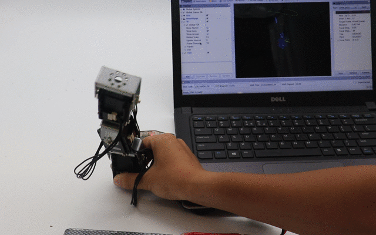

# Snake Robot

a 7-DoF snake robot.

Robotis Dynamixel MX-28AR, Protocol1.0.

Ubuntu 16.04 LTS, ROS kinetic, ROS Control.

## Install

	# 1. install ros kinetic and create workspace

	# 2. install dynamixel lib
	git clone https://github.com/ROBOTIS-GIT/DynamixelSDK.git
	cd DynamixelSDK/c++/build/linux64
	make
	sudo make install
	export LD_LIBRARY_PATH=$LD_LIBRARY_PATH:/usr/local/lib # add dynamixel lib install path
	
	# 3. get code
	cd ~/catkin_ws/src
	git clone https://github.com/guzhaoyuan/snake_robot.git
	git clone https://github.com/guzhaoyuan/snake_moveit_config.git
	cd ..
	catkin_make
	
Note: dynamixel communicate using RS485, the official hardware for communicating with dynamixel is USB2Dynamixel. After insert USB2Dynamixel:

	sudo chmod 777 /dev/ttyUSB0

Warning: before making any move, make sure the sorvo is not gonna interfere with anything to prevent damage or harm!!

## Design

## Hardware Setup

## Demo

- [x] ping servo.

		cd snake_robot/test/ping
		make
		./ping

- [x] Draw a circle using 2 joints.

		roslaunch snake_robot display_twoJointsSnake.launch 

- [x] Draw a circle using 7 joints.

		roslaunch snake_robot display_sevenJointSnake.launch 

- [x] simulate snake using ros control

		roslaunch snake_robot snake_world.launch # launch gazebo and load urdf snake
		roslaunch snake_robot snake_robot_control.launch # pop up controllers for each joint
		rostopic pub /snake/joint1_position_controller/command std_msgs/Float64 "data: 1.0" # send command to controller

- [x] control real snake using ros control

		roslaunch snake_robot main.launch # launch main including controller_manager and pop up controllers for each joint and keep updating state
		rostopic pub /snake/joint1_position_controller/command std_msgs/Float64 "data: 0.1" # send command to controller

- [x] control real 2 joint snake to draw ellipse using ros control
		
		roslaunch snake_robot main.launch # launch main including controller_manager and pop up controllers for each joint and keep updating state
		roslaunch snake_robot display_twoJointsSnake.launch # publish to joint's command topic to control real robot

- [x] IK for a 3-DoF snake

		roslaunch three_joint_snake_moveit_config demo.launch
		rosrun snake_robot IK_client 

- [x] IK for a 7-DoF snake to draw circle

		roslaunch seven_joint_snake_moveit_config demo.launch
		rosrun snake_robot showpath link8 # you can show path of any link in the robot 

## TODO

- [x] soft limit and transmission jnt motor space convert
- [x] put the snake in gazebo to see how it does in real world
- [x] IK for 2-DoF snake
- [x] implement position interface
- [x] drive one motor
- [x] resource management
- [x] IK for 7-DoF snake
- [x] Draw a circle using 7 joint.

## Resources

- [eManual](http://support.robotis.com/en/product/actuator/dynamixel/mx_series/mx-28(2.0).htm)
- [Protocol 1.0](https://github.com/ROBOTIS-GIT/DynamixelSDK)
- [git manual](https://github.com/ROBOTIS-GIT/emanual/blob/master/docs/en/dxl/mx/mx-28-2.md)
- [drawing](https://github.com/ROBOTIS-GIT/emanual/blob/master/docs/en/dxl/mx/mx-28-2.md#drawings)
- [ros dynamixel tutorial](http://wiki.ros.org/dynamixel_controllers/Tutorials/Creating%20a%20joint%20torque%20controller)
- [robotHW that I consult from](https://github.com/xmproject/xm_robothw)